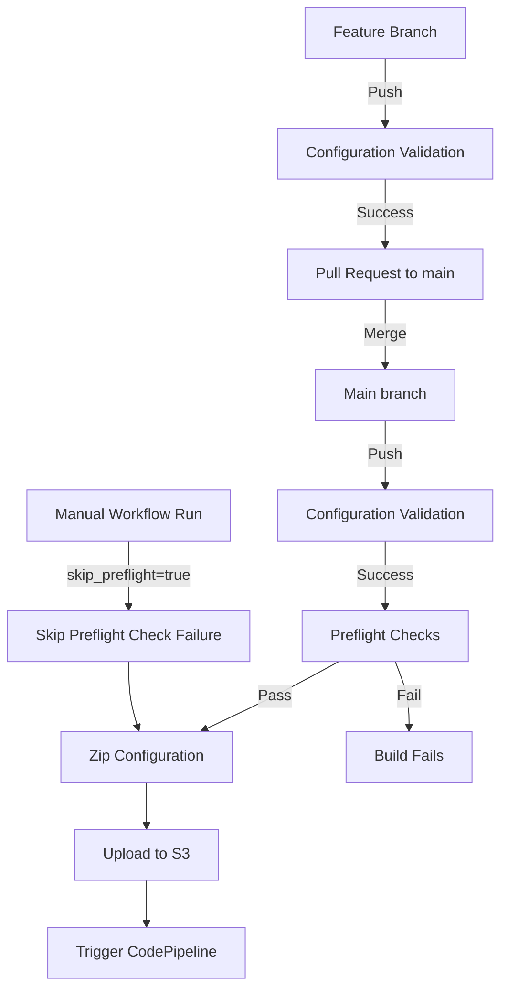

# AWS Landing Zone Accelerator (LZA) Configuration

This repository manages the configuration files for deploying an AWS environment using the [Landing Zone Accelerator on AWS (LZA)](https://aws.amazon.com/solutions/implementations/landing-zone-accelerator-on-aws/). It utilizes a GitHub Actions workflow for validation and automated deployment.

New to this repository? Check out the [Getting Started Guide](GETTING_STARTED.md) for step-by-step instructions on initial setup.

## Purpose

While the LZA configuration is a great way to drive compliance and standards of your AWS enviroment, it can take up to 90 minutes to execute a build which can be frustrating time delay if the configuration is incorrect or incomplete. The purpose of this project is:

*   **Version Control:** Maintain a history of LZA configuration changes.
*   **Automation:** Automate the validation and deployment of LZA configurations via CI/CD.
*   **Collaboration:** Facilitate team collaboration on infrastructure configuration.
*   **Faster Feedback:** By performing LZA configuration tests, we can improve the change failure rate and the time duration for identifying failures. 

## Configuration Files (`config/`)

The `config/` directory contains the core YAML files defining your LZA environment. Key files include:

*   `accounts-config.yaml`: Defines AWS accounts and OU placement.
*   `global-config.yaml`: Contains global settings (regions, Control Tower, logging, etc.).
*   `iam-config.yaml`: Defines Identity Center, IAM policies, roles, groups, etc.
*   `network-config.yaml`: Specifies VPCs, Transit Gateway, network services, etc.
*   `organization-config.yaml`: Defines OU structure, SCPs, tagging policies, etc.
*   `security-config.yaml`: Configures central security services (GuardDuty, Security Hub, etc.).

In addition, there are additional configuration items (for instance permission sets, Service Control Policies, AWS Config rules) depending on the configuration items in the core LZA configuration.

Refer to the official [LZA Configuration Documentation](https://docs.aws.amazon.com/solutions/latest/landing-zone-accelerator-on-aws/configuration-files.html) for detailed schema information.

## CI/CD Workflow (`.github/workflows/lza_config_ci.yaml`)

This workflow automates the validation and deployment process.

### GitFlow Diagram




### Triggers

The workflow runs on:

1.  **Push:** To `main` or any branch when files in `config/`, or the workflow file itself are changed. For instance, after merging a Pull Requst.
2.  **Pull Request:** Targeting the `main` branch when files in `config/`, or the workflow file are changed.
3.  **Manual Trigger (`workflow_dispatch`):** Allows running the workflow manually via the GitHub Actions UI.
    *   **Input:** `skip_preflight` (boolean, default: `false`) - If set to `true` during a manual run, the preflight check step will be skipped. **Only use when `AWS ControlTower` is in an unknown state and re-executing this pipeline will address the issue.**


### Required GitHub Secrets

The `deploy` job requires the following variables (`Settings > Secrets and variables > Actions`):

| Name | Type | Description |
|------|------|-------------|
| `AWS_OIDC_ROLE_ARN` | Secret | ARN of the IAM Role for GitHub Actions OIDC authentication. Must have permissions for S3 upload, CodePipeline start, and the preflight check actions (e.g., `cloudformation:ListStacks`, `controltower:ListLandingZones`, `controltower:GetLandingZone`). |
| `S3_BUCKET` | Secret | Name of the LZA configuration S3 bucket where the zip configuration files are stored. |
| `AWS_REGION` | Environment | AWS region where LZA Home Resources (CodePipeline, S3 bucket) reside. |
| `S3_KEY_PREFIX` | Environment | (Optional) Prefix within the S3 bucket for the zip file. |
| `CODEPIPELINE_NAME` | Environment | Name of the LZA CodePipeline to trigger. |
| `LZA_STACK_PREFIX` | Environment | Prefix used for LZA CloudFormation stacks (required for preflight check script). |

Note: Only `AWS_OIDC_ROLE_ARN` and `S3_BUCKET` needs to be added as a secret variable. All other variables should be added as environment variables.

## Usage

1.  **Modify Configuration:** Edit the YAML files in the `config/` directory.
2.  **Commit & Push:** Commit changes to a feature branch and push.
3.  **Pull Request:** Create a Pull Request targeting `main`. The `validate` job runs automatically.
4.  **Merge:** After review and approval, merge the Pull Request into `main`.
5.  **Deploy:** The merge triggers the `validate` and `deploy` jobs, uploading the configuration and starting the LZA CodePipeline.

### Validation

For detailed instructions on validating your LZA configuration locally before deployment, see the [LZA Validation Guide](LZA_VALIDATION.md).

## Checks Performed

1.  **Failed CloudFormation Stacks:** Checks for any CloudFormation stacks in a specified AWS region that are in a failed state (e.g., `CREATE_FAILED`, `ROLLBACK_COMPLETE`, etc.) and match a defined prefix.
    *   Default Prefix: `AWSAccelerator` (can be overridden).
2.  **Control Tower Landing Zone Status:** Checks if AWS Control Tower is enabled and, if so, verifies that the Landing Zone status is `ACTIVE`. It also logs warnings if the Landing Zone is drifted (`DRIFTED`) or not up-to-date with the latest version.
    *   **Note:** This check verifies the status of the Landing Zone resource itself, not the detailed compliance status of every account and OU against all Control Tower controls. A comprehensive compliance check would typically involve more complex queries against AWS Config or Security Hub, likely within the AWS Audit account.

## Project Structure

```
.
├── .github/
│   └── workflows/
│       ├── lza_config_ci.yaml  # CI/CD pipeline for LZA config
│       └── preflight.yml       # Preflight check tests
├── config/                    # Landing Zone Accelerator configuration
│   ├── accounts-config.yaml
│   ├── customizations-config.yaml
│   ├── global-config.yaml
│   ├── iam-config.yaml
│   ├── network-config.yaml
│   ├── organization-config.yaml
│   ├── replacements-config.yaml
│   ├── security-config.yaml
│   └── customizations/        # Custom CloudFormation templates
├── oicd-setup/                # OIDC setup for GitHub Actions
├── preflight_checks/
│   ├── __init__.py
│   └── aws_checks.py         # Core checking logic
├── scripts/
│   ├── validate_json_configs.py
│   ├── validate_landing_zone_schema.py
│   └── validate_replacements.py
├── tests/
│   ├── __init__.py
│   └── test_aws_checks.py    # Unit tests
├── requirements.txt          # Python dependencies
└── README.md                 # This file
```


## Future Enhancements

*   **Detailed Control Tower Compliance:** Implement checks against AWS Config or Security Hub (likely requiring execution within the Audit account or cross-account permissions) to verify individual account/OU compliance against specific controls.
*   **More Granular Error Handling:** Refine error handling for specific AWS API exceptions.
*   **Configurable Failure Conditions:** Allow configuration for whether Landing Zone drift or outdated versions should cause the check to fail (currently they only log warnings). 