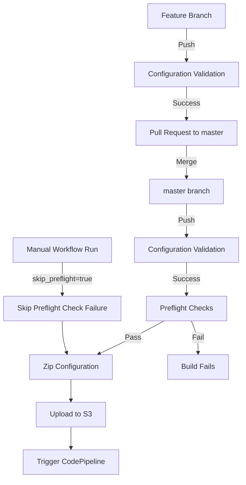

# AWS Landing Zone Accelerator (LZA) Configuration

This repository manages the configuration files for deploying an AWS environment using the [Landing Zone Accelerator on AWS (LZA)](https://aws.amazon.com/solutions/implementations/landing-zone-accelerator-on-aws/). It utilizes a GitHub Actions workflow for validation and automated deployment.

## Purpose

*   **Version Control:** Maintain a history of LZA configuration changes.
*   **Automation:** Automate the validation and deployment of LZA configurations via CI/CD.
*   **Collaboration:** Facilitate team collaboration on infrastructure configuration.

## Configuration Files (`config/`)

The `config/` directory contains the core YAML files defining your LZA environment. Key files include:

*   `accounts-config.yaml`: Defines AWS accounts and OU placement.
*   `global-config.yaml`: Contains global settings (regions, Control Tower, logging, etc.).
*   `iam-config.yaml`: Defines Identity Center, IAM policies, roles, groups, etc.
*   `network-config.yaml`: Specifies VPCs, Transit Gateway, network services, etc.
*   `organization-config.yaml`: Defines OU structure, SCPs, tagging policies, etc.
*   `security-config.yaml`: Configures central security services (GuardDuty, Security Hub, etc.).

Refer to the official [LZA Configuration Documentation](https://docs.aws.amazon.com/solutions/latest/landing-zone-accelerator-on-aws/configuration-files.html) for detailed schema information.

## CI/CD Workflow (`.github/workflows/lza_config_ci.yaml`)

This workflow automates the validation and deployment process.

### GitFlow Diagram




### Triggers

The workflow runs on:

1.  **Push:** To `master` or any branch when files in `config/`, `schema.yaml`, or the workflow file itself are changed.
2.  **Pull Request:** Targeting the `master` branch when files in `config/`, `schema.yaml`, or the workflow file are changed.
3.  **Manual Trigger (`workflow_dispatch`):** Allows running the workflow manually via the GitHub Actions UI.
    *   **Input:** `skip_preflight` (boolean, default: `false`) - If set to `true` during a manual run, the preflight check step will be skipped. **Only use when `AWS ControlTower` is in an unknown state and re-executing this pipeline will address the issue.**

### Jobs

1.  **`validate`:**
    *   Runs on all pushes and pull requests specified in the triggers.
    *   Checks out the code.
    *   Installs `yamllint`.
    *   Lints all YAML files in the `config/` directory to ensure correct syntax and basic style.

2.  **`deploy`:**
    *   Runs **only** on push events to the `main` branch, after the `validate` job succeeds.
    *   Checks out the code.
    *   **Configure AWS Credentials:** Authenticates to AWS using OIDC via an IAM role specified in secrets.
    *   **Run LZA Preflight Checks (Conditional):**
        *   Installs Python dependencies from `requirements.txt`.
        *   Executes the `lza_preflight_check.py` script (checking for failed CloudFormation stacks and Control Tower status).
        *   **Skipped if:** The workflow was triggered manually (`workflow_dispatch`) **and** the `skip_preflight` input was set to `true`.
    *   **Zip Configuration Files:** Creates `aws-accelerator-config.zip` containing the contents of the `config/` directory.
    *   **Upload Config to S3:** Uploads the zip file to the LZA configuration S3 bucket specified in secrets.
    *   **Trigger CodePipeline:** Starts an execution of the LZA CodePipeline specified in secrets, providing a link to the execution details.

### Required GitHub Secrets

The `deploy` job requires the following variables (`Settings > Secrets and variables > Actions`):

| Name | Type | Description |
|------|------|-------------|
| `AWS_OIDC_ROLE_ARN` | Secret | ARN of the IAM Role for GitHub Actions OIDC authentication. Must have permissions for S3 upload, CodePipeline start, and the preflight check actions (e.g., `cloudformation:ListStacks`, `controltower:ListLandingZones`, `controltower:GetLandingZone`). |
| `AWS_REGION` | Environment | AWS region where LZA Home Resources (CodePipeline, S3 bucket) reside. |
| `S3_BUCKET` | Environment | Name of the LZA configuration S3 bucket. |
| `S3_KEY_PREFIX` | Environment | (Optional) Prefix within the S3 bucket for the zip file. |
| `CODEPIPELINE_NAME` | Environment | Name of the LZA CodePipeline to trigger. |
| `LZA_STACK_PREFIX` | Environment | Prefix used for LZA CloudFormation stacks (required for preflight check script). |

Note: Only `AWS_OIDC_ROLE_ARN` needs to be added as a secret variable. All other variables should be added as environment variables.

## Usage

1.  **Modify Configuration:** Edit the YAML files in the `config/` directory.
2.  **Commit & Push:** Commit changes to a feature branch and push.
3.  **Pull Request:** Create a Pull Request targeting `master`. The `validate` job runs automatically.
4.  **Merge:** After review and approval, merge the Pull Request into `master`.
5.  **Deploy:** The merge triggers the `validate` and `deploy` jobs, uploading the configuration and starting the LZA CodePipeline.

### Local Validation (Optional)

You can validate YAML files locally before pushing:

```bash
# Install yamllint (if not already installed)
pip install yamllint

# Run linter
yamllint config/
```

### Local Preflight Checks (Optional)

You can run the preflight checks script locally:

```bash
# Create and activate a virtual environment
python -m venv .venv
source .venv/bin/activate # or .venv\Scripts\activate

# Install dependencies
pip install -r requirements.txt

# Configure AWS credentials in your environment
# (e.g., using environment variables or aws configure)

# Set required environment variables
export AWS_REGION="your-aws-region"
# export CT_HOME_REGION="your-ct-home-region" # If different from AWS_REGION
export LZA_STACK_PREFIX="your-lza-stack-prefix"

# Run the script (adjust path if necessary)
python lza_preflight_check.py --prefix "$LZA_STACK_PREFIX"
```

## Checks Performed

1.  **Failed CloudFormation Stacks:** Checks for any CloudFormation stacks in a specified AWS region that are in a failed state (e.g., `CREATE_FAILED`, `ROLLBACK_COMPLETE`, etc.) and match a defined prefix.
    *   Default Prefix: `AWSAccelerator` (can be overridden).
2.  **Control Tower Landing Zone Status:** Checks if AWS Control Tower is enabled and, if so, verifies that the Landing Zone status is `ACTIVE`. It also logs warnings if the Landing Zone is drifted (`DRIFTED`) or not up-to-date with the latest version.
    *   **Note:** This check verifies the status of the Landing Zone resource itself, not the detailed compliance status of every account and OU against all Control Tower controls. A comprehensive compliance check would typically involve more complex queries against AWS Config or Security Hub, likely within the AWS Audit account.

## Project Structure

```
.
├── .github/
│   └── workflows/
│       └── preflight.yml  # GitHub Actions workflow
├── preflight_checks/
│   ├── __init__.py
│   └── aws_checks.py    # Core checking logic
├── tests/
│   ├── __init__.py
│   └── test_aws_checks.py # Unit tests
├── requirements.txt       # Python dependencies
└── README.md              # This file
```

## Prerequisites

*   Python 3.9+
*   AWS Credentials configured (e.g., via environment variables, IAM role) with necessary permissions:
    *   `cloudformation:ListStacks`
    *   `controltower:ListLandingZones`
    *   `controltower:GetLandingZone`

## Usage

### Local Execution

1.  **Install Dependencies:**
    ```bash
    python -m venv .venv
    source .venv/bin/activate # or .venv\Scripts\activate on Windows
    pip install -r requirements.txt
    ```

2.  **Configure AWS Credentials:** Ensure your environment is configured with valid AWS credentials (e.g., set `AWS_ACCESS_KEY_ID`, `AWS_SECRET_ACCESS_KEY`, `AWS_SESSION_TOKEN`, or use an instance profile/role).

3.  **Set Environment Variables (Optional):**
    *   `AWS_REGION`: (Required) The AWS region to run the checks in (e.g., `us-east-1`, `eu-west-2`). This is used for the CloudFormation check and as the default for the Control Tower check.
    *   `CT_HOME_REGION`: (Optional) The AWS region where your Control Tower Landing Zone is homed. Defaults to the value of `AWS_REGION` if not set. Required if your Control Tower home region differs from the `AWS_REGION` you want to check CloudFormation stacks in.
    *   `STACK_PREFIX`: (Optional) The prefix for CloudFormation stacks to check for failures. Defaults to `AWSAccelerator`.

4.  **Run Checks:**
    ```bash
    # Example:
    export AWS_REGION="eu-west-1"
    # export CT_HOME_REGION="us-east-1" # If different
    # export STACK_PREFIX="MyProject-" # If different

    python -m preflight_checks.aws_checks
    ```
    The script will exit with code `0` if all checks pass, and `1` if any check fails or an error occurs.

### GitHub Actions

The `.github/workflows/preflight.yml` workflow automates these checks, typically on pull requests or manually via `workflow_dispatch`.

*   **Authentication:** Uses AWS OIDC for secure, short-lived credentials. You need to configure an IAM Role in your AWS account with the necessary permissions and establish a trust relationship with GitHub Actions.
*   **Configuration:**
    *   Update the `role-to-assume` parameter in the workflow file with the ARN of your IAM role.
    *   The `AWS_REGION` and `CT_HOME_REGION` are set as environment variables in the workflow. You can modify these defaults.
    *   The `STACK_PREFIX` can be overridden using GitHub repository secrets or variables (see commented-out examples in the workflow file).

## Running Tests

Unit tests using `pytest` and `moto` are included.

1.  **Install Test Dependencies (if not already done):**
    ```bash
    pip install -r requirements.txt
    ```

2.  **Run Tests with Coverage:**
    ```bash
    pytest tests/ --cov=preflight_checks --cov-report=term-missing
    ```

    To generate an XML coverage report (e.g., for CI integration):
    ```bash
    pytest tests/ --cov=preflight_checks --cov-report=xml
    ```

## Future Enhancements

*   **Detailed Control Tower Compliance:** Implement checks against AWS Config or Security Hub (likely requiring execution within the Audit account or cross-account permissions) to verify individual account/OU compliance against specific controls.
*   **More Granular Error Handling:** Refine error handling for specific AWS API exceptions.
*   **Configurable Failure Conditions:** Allow configuration for whether Landing Zone drift or outdated versions should cause the check to fail (currently they only log warnings). 